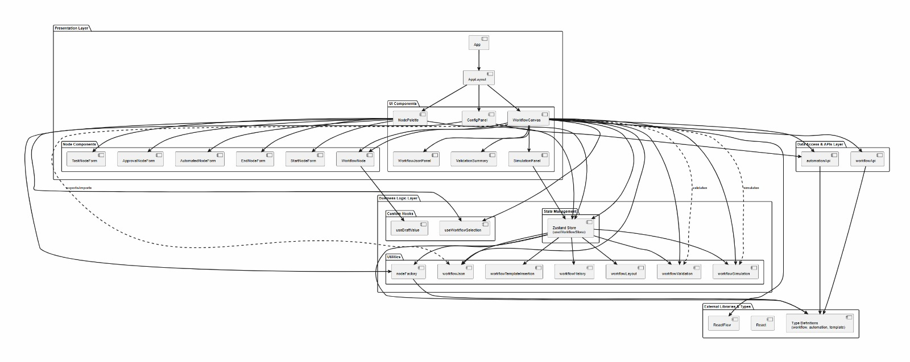
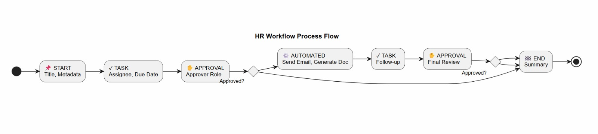
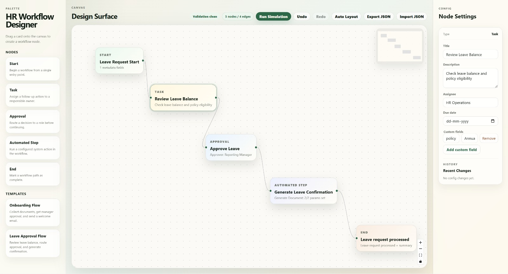

HR Workflow Management Module

Introduction

This project is a scalable and modular workflow builder designed for HR teams to visually create, validate, and simulate business processes. It emphasizes clarity, real-time interaction, and a maintainable architecture, reflecting modern frontend development practices used in real-world applications.

Core Features

Intuitive drag-and-drop interface for creating nodes and connections
Dynamic node configuration with built-in validation
Real-time workflow validation, including structure, connectivity, and cycle detection
Undo/Redo functionality for smooth and flexible editing
Dual workflow modes: Build and Review
Simulation engine for testing workflow execution
Modular and extensible component-based architecture

Bonus Features:

Interactive sandbox environment for experimenting with workflows
Built-in performance insights and analytics
Easily extendable node system for custom workflow requirements
Clear separation between UI, business logic, and data layers
Architecture Diagram

The system follows a layered frontend architecture to ensure scalability and maintainability: 

Application Layer – Manages overall orchestration and state flow
UI Components – Includes canvas, nodes, forms, and panels
Business Logic – Handles validation and workflow processing
API Layer – Provides a mock backend for simulation
Data & Types – Structured using TypeScript models
External Libraries – Utilizes React and graph rendering tools

Workflow Diagram

This diagram illustrates how workflows are created and executed:

Nodes are dragged from the palette onto the canvas
Each node is configured through dedicated form panels
The system performs real-time validation of the workflow
The workflow is executed using the simulation engine
Results are displayed through insights and performance metrics
Preview

The application provides an interactive interface for building and testing workflows:

Visual canvas for designing workflows
Sidebar panels for configuration and analytics
Simulation panel for execution feedback
Preview Photo
 

What You See in the Preview Photo

A central canvas displaying nodes and their connections
A left-side palette for dragging workflow elements
A right-side panel for configuration and insights
Controls for switching modes and managing workflows
Simulation output along with performance metrics

How to Run
# Clone the repository
git clone <repo-url>

# Navigate into the project directory
cd <project-folder>

# Install dependencies
npm install

# Start the development server
npm run dev

Tech Stack

Frontend: React + TypeScript
State Management: Custom implementation with undo/redo support
Graph Rendering: React Flow (@xyflow/react)
Styling: CSS and UI libraries
API: Mock API used for simulation

Design Decisions

Developed using a component-driven architecture for scalability
Maintains clear separation of concerns across UI, logic, and data
Uses centralized state management to ensure workflow consistency
Validation is implemented as an independent module for reusability
Mock API layer decouples frontend from backend dependencies
Designed to be easily extensible for future workflow enhancements

What’s Completed

Fully functional workflow builder (nodes and edges)
Node configuration and editing system
Core validation engine
Simulation sandbox environment
Modular and maintainable project structure
Key user interactions such as drag, connect, and edit

Future Enhancements

Integration with a real backend and persistent storage
Role-based access control and workflow permissions
Advanced analytics and reporting capabilities
Real-time collaboration with multi-user editing
Workflow versioning and history tracking
Plugin system for custom nodes and actions
Performance optimizations for handling large-scale workflows
